# How TOPS connects to AWS

> **Written for security reviewers.** If you have been asked to approve TOPS for your AWS
> organisation, this page is the whole answer. No prior knowledge of TOPS is assumed.

TOPS runs on your infrastructure and reads your AWS accounts through cross-account IAM roles.
There are no stored access keys, no inbound network path to the install, and no data path to
us. This page shows exactly what gets created, who creates it, and what crosses each boundary.

The diagrams use three zones throughout:

| Zone | What it is |
| --- | --- |
| **Your infrastructure** | The server you run TOPS on. Owns the database, the findings, and the only copy of the role ARNs |
| **Your parent AWS account** | One account you nominate. Holds an SNS topic, SQS queues and one S3 bucket. Deployed once |
| **Child accounts** | Every account you want scanned. Each gets one CloudFormation stack and one IAM role |

---

## Stage 1 — Standing up the parent account

*Run once · `./install.sh --aws` · one region*

The installer runs as a throwaway container on your own machine, using your own AWS CLI
credentials. It deploys two CloudFormation stacks into an account you choose, then writes the
resulting queue names and ARNs back to disk. Nothing here is shared with other installs.

1. **Deploy.** The installer checks `sts:get-caller-identity`, confirms the account and region
   with you, then runs `sam deploy`.
2. **Create.** CloudFormation creates the topic, the queues, the dead-letter queue and the
   bucket. You own all of it.
3. **Subscribe.** `teemops-sns` is subscribed to `teemops_main`, so a notification becomes a
   queue message.
4. **Report back.** Stack outputs are written to `generated/teemops.env` and loaded by the
   containers on restart.

Two of the four queues — `teemops_audit` and `teemops_audit_region` — are created but stay
idle. Scans run on the database queue by default; those two exist for operators who want to
move scanning onto SQS.

**This step is optional.** TOPS runs without it — you just cannot link an account yet. You can
come back later with `./install.sh --aws-only`. Everything above is removed by deleting two
CloudFormation stacks.

---

## Stage 2 — Connecting child accounts

*Repeat per account · no limit · no per-account infrastructure in the parent*

TOPS never asks for credentials to a child account. It hands the account's own administrator a
CloudFormation quick-create link, pre-filled with an `ExternalId` generated for that account
alone. The administrator creates the stack in their own console, under their own session.

1. **Hand over a link.** A console quick-create URL carrying four parameters: your parent
   account id, the region, the account's `ExternalId` and its `UniqueId`.
2. **The admin creates the stack.** In their account, with their permissions. TOPS has no
   session there and cannot create it for them.
3. **The stack calls home.** A custom resource publishes the new role ARN, external id and
   unique id to your SNS topic, which fans into `teemops_main`.
4. **Your worker picks it up.** Outbound long-poll from inside your network. The message is
   accepted only if both ids match a record you already created.
5. **The stack completes.** TOPS replies to the CloudFormation `ResponseURL`; the admin sees
   `CREATE_COMPLETE`, or a failure with a reason.

**Why there is no account limit.** Linking adds one stack in the child account and one database
row in yours — no queue, no topic, no bucket, no per-account resource in the parent. The tenth
account and the thousandth cost the same to connect. Deleting the stack fires the same custom
resource in reverse and unlinks it.

---

## Stage 3 — What actually runs

*One `docker-compose.yml` · one host · `docker compose up -d`*

TOPS is a Laravel monolith and a MySQL database, split across containers by role. The web tier
never talks to AWS. The worker tier does — outbound only, assuming a role per scan and holding
the credentials for the life of one job.

1. **The UI enqueues, it does not scan.** Starting a scan writes a job row. The web tier holds
   no AWS credentials at all.
2. **Workers poll the database.** Scan jobs use the database queue driver, with
   `SELECT … FOR UPDATE SKIP LOCKED` so five workers never collide.
3. **Account linking polls SQS.** The only pool that needs AWS messaging, and it stays switched
   off until `TOPS_SQS_ARN` is set.
4. **Scanning assumes the role.** One `AssumeRole` per job, temporary credentials, read calls,
   results written home.

A full scan of one account fans out to roughly 153 region jobs across five worker processes.
Raise `TOPS_WORKER_PROCESSES` only with the memory and the AWS API rate limits to match.

---

## What crosses the boundary

| Direction | Traffic | Carries | When |
| --- | --- | --- | --- |
| **Outbound** | HTTPS to AWS API endpoints, signed with credentials from `sts:AssumeRole` | Describe / List / Get calls against the account being scanned | During a scan |
| **Outbound** | SQS `ReceiveMessage` / `DeleteMessage` long-poll | Nothing — an empty poll until a stack is created | Continuously, if AWS messaging is set up |
| **Into your AWS** | One `sns:Publish` from the child account's CloudFormation stack | Role ARN, external id, unique id | Once per account, at link and at unlink |
| **Never** | Inbound connections to the TOPS host | There is no listener. AWS is polled, not called back | — |
| **Never** | Long-lived AWS access keys | None are requested, entered, or stored | — |
| **Never** | Findings, inventory or account metadata leaving your install | Scan output is written to your MySQL and stays there | — |

There is no telemetry endpoint, no licence check, and no hosted control plane in this path. The
container image is the only thing you pull from outside, and you can build it yourself with
`install-build.sh`.

---

## What the child-account role can actually do

Worth being precise about, because it is the first question every security reviewer asks. **The
role is not read-only.** Scanning uses only the read half; the write half exists for the
operational features that manage AWS security services on your behalf.

**Read — used by every scan**

- `ReadOnlyAccess` (AWS managed)
- `ResourceGroupsandTagEditorReadOnlyAccess`

This is the whole permission set the scanner exercises.

**Write — only for the operational features**

- `securityhub:*`, `guardduty:*`, `macie:*`, `inspector:*`
- `config:Put*` / `Delete*` — rules, recorders, delivery channels, conformance packs
- `cloudtrail:` create, update, delete, start/stop logging
- `logs:` create/delete log groups, streams, metric filters
- `cloudformation:` create, update, delete, change sets
- `s3:CreateBucket` / `DeleteBucket` (for AWS Config delivery)
- `iam:PassRole` → `arn:aws:iam::*:role/tops*`

**If you only want scanning, remove the write policies.** The template is a plain
CloudFormation file in your own S3 bucket. Strip the policies you do not want before you
publish the link — the scanner keeps working, the operational features stop.

---

## The shape of it, in numbers

| | |
| --- | --- |
| **2** stacks in the parent | Deployed once. Delete them and the integration is gone |
| **1** stack per child account | Created by that account's own admin. Revocable by them at any time |
| **0** stored AWS keys | Cross-account roles with a per-account external id, assumed per job |
| **0** inbound ports | Every connection is opened from inside your network |
| **~153** region jobs per full scan | Fanned across five worker processes by default |
| **6** containers on one host | app, worker, mysql, backup, maildev, and a restore container that stays parked |

---

## Related

- [Installing TOPS](https://github.com/teemops/tops#install) — the commands, kept in one place in the repository
- [The child-account CloudFormation template](https://github.com/teemops/tops/blob/develop/templates/iam.role.child.account.cfn.yaml) — every policy this page summarises, in full
- [Licence and trademark](https://github.com/teemops/tops/blob/develop/LICENSE) — Apache-2.0, with the name held separately

*Source of truth for this page: `templates/iam.role.child.account.cfn.yaml`,
`infra/cloud-stack/`, and `docker-compose.yml` in the TOPS repository.*
